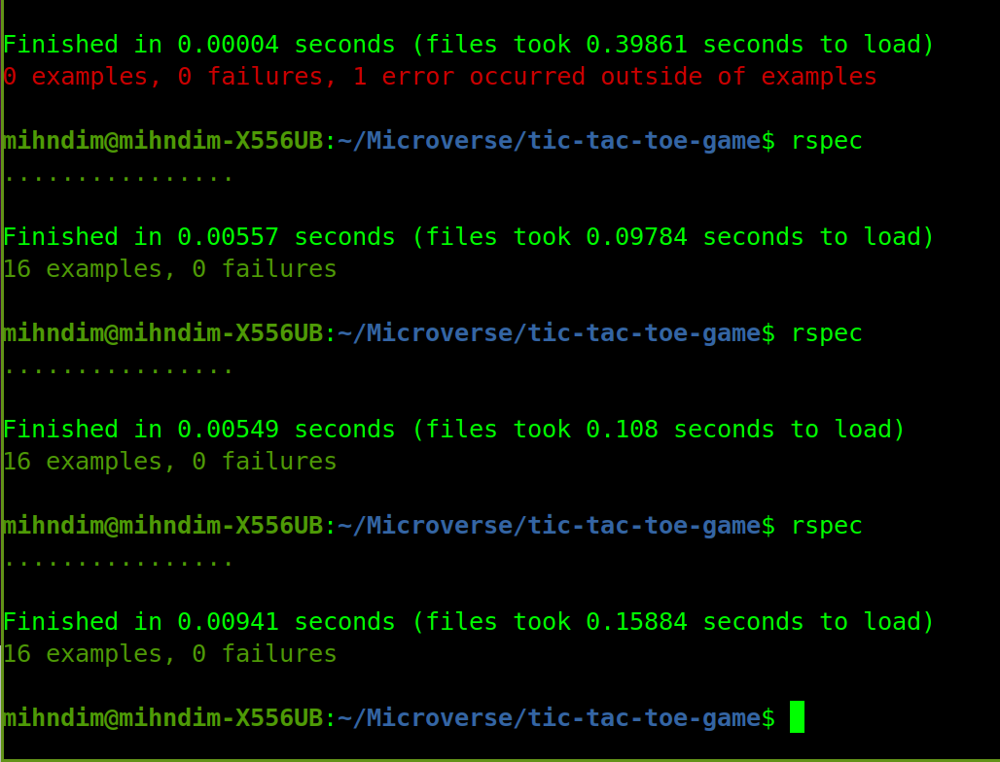

# Tic-tac-toe-game
This is the implementation of the popular TIC-TAC-TOE Game created using the Ruby programming Language

The first milestone is to create the necessary files and folders and make the file executable

Tic Tac Toe - Ruby OOP
Game Rules
- Each player is going to choose a number out of 9 positions.
- First player should enter his name and press enter.
- Second player should enter his name and press enter.
- First player should enter his symbol [X or O] and press enter.
- To choose a position you have to type the corresponding number and press enter.
- The game will check if the chosen number is valid or not valid.
- If it's not valid (i.e already taken number or not of the game positions - from 1 to 9 ) it will ask for another input.
- If it's valid it will display the board with the chosen position replaced by the symbol of the player [X, O].
- Then it will ask the next player to take turn.
- It will repeate the same for the second player.
- The game contiues till it reaches either winning or draw conditions.

Winning conditions
We have 8 winning conditions...

- First three, to have occupied a full row with the same symbol [X, O]
- Second three, to have occupied a column with same symbol [X, O]
- Third two, to have occupied a full diagonal with same symbol [X, O]

Draw condition
- If 9 movements achieved with no winning then the game is a draw.


Built With:

- Ruby
- VS Code
- Ubuntu
- Rubocop linter

## Getting Started

To get your own copy of our project simply clone the repository to your local machine.

Step 1: Type the following command into a git shell

git clone https://github.com/charlyeneh/tic-tac-toe-game

Step 2: Direct a terminal into the cloned repository directory

cd tic-tac-toe-game

Step 3: Run the program from command line

Step 4: Run main.rb from your terminal to display "Hello World!".


# Testing Tic-tac-toe with RSpec 

> In this project we incoperated some testing using RSpec at the end of the tic-tac-toe game



## Built With

- Ruby

## Getting Started
- Open CMD
- Git clone https://github.com/charlyeneh/tic-tac-toe-game-
- Make sure Ruby is installed on your computer

## Testing with Rspec

This project is tested with Rspec which is a computer domain-specific language (DSL) testing tool written in the Ruby programming language

## How to get Rspec Running

- Run the following command in the terminal
  ```
  gem install rspec
  ```
- This command installs Rspec on your computer. You ensure that Rspec is installed by running the following     command to see the installed version
  ```
  rspec --version
  ```
- You should get output similar to the following:
  ```
  RSpec 3.10
    - rspec-core 3.10.1
    - rspec-expectations 3.10.1
    - rspec-mocks 3.10.2
    - rspec-support 3.10.2
  ```
  The rspec gem comes packed with all we need to get started including the 5 gems listed above.

- Navigagte into the AdvancedBuildingBlocks-Enumerables folder
  ```
  cd AdvancedBuildingBlocks-Enumerables
  ```
- Run the following command to initialize Rspec
  ```
  rspec --init
  ```
- This generates a /spec folder and a .rspec file at the root of your project

- Finally, to run the tests, simple run:
  ```
  rspec
  ```

## Authors

👤 **Mih Julius Ndim**

- GitHub: [@Mihndim2020](https://github.com/mihndim2020)
- Linkedin: [Mih Julius](https://www.linkedin.com/in/mih-julius)
- Twiter: [@mihndim](https://twitter.com/mihndim)


👤 **German Cobian**

- GitHub: [@German Cobian](https://github.com/German-Cobian)
- Twitter: [@German Cobian](https://twitter.com/GermanCobian3)


## 🤝 Contributing

Contributions, issues, and feature requests are welcome!

## Show your support

Give a ⭐️ if you like this project!

## 📝 License

MIT License

Copyright (c) 2021 Mih Julius Ndim and German Cobian 

Permission is hereby granted, free of charge, to any person obtaining a copy
of this software and associated documentation files (the "Software"), to deal
in the Software without restriction, including without limitation the rights
to use, copy, modify, merge, publish, distribute, sublicense, and/or sell
copies of the Software, and to permit persons to whom the Software is
furnished to do so, subject to the following conditions:

The above copyright notice and this permission notice shall be included in all
copies or substantial portions of the Software.

THE SOFTWARE IS PROVIDED "AS IS", WITHOUT WARRANTY OF ANY KIND, EXPRESS OR
IMPLIED, INCLUDING BUT NOT LIMITED TO THE WARRANTIES OF MERCHANTABILITY,
FITNESS FOR A PARTICULAR PURPOSE AND NONINFRINGEMENT. IN NO EVENT SHALL THE
AUTHORS OR COPYRIGHT HOLDERS BE LIABLE FOR ANY CLAIM, DAMAGES OR OTHER
LIABILITY, WHETHER IN AN ACTION OF CONTRACT, TORT OR OTHERWISE, ARISING FROM,
OUT OF OR IN CONNECTION WITH THE SOFTWARE OR THE USE OR OTHER DEALINGS IN THE
SOFTWARE.
=======
